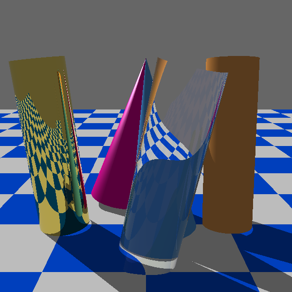

# Raytracing
CPU sugárkövető program dülöngélő hengerekre meg kúpokra

## Leírás
A feladat a sugárkövetés algoritmusának implementálása dülöngélő kúp és henger felületekre. A virtuális világunkban a „függőlegesen felfelé” az y tengely, az egység a méter. A világban hat objektum található:
- Kék-fehér sakktábla mintázatú, origó középpontú, 20x20 méteres diffúz négyzet.
- Egy optikailag sima, tükröző arany henger.
- Egy optikailag sima, tükröző, fénytörő és átlátszó víz henger.
- Egy sárga műanyag diffúz-spekuláris henger.
- Egy cián diffúz-spekuláris kúp.
- Egy magenta diffúz-spekuláris kúp.

Kameramozgatás az ``A`` billentyűvel.

## JPorta által elfogadott kép

