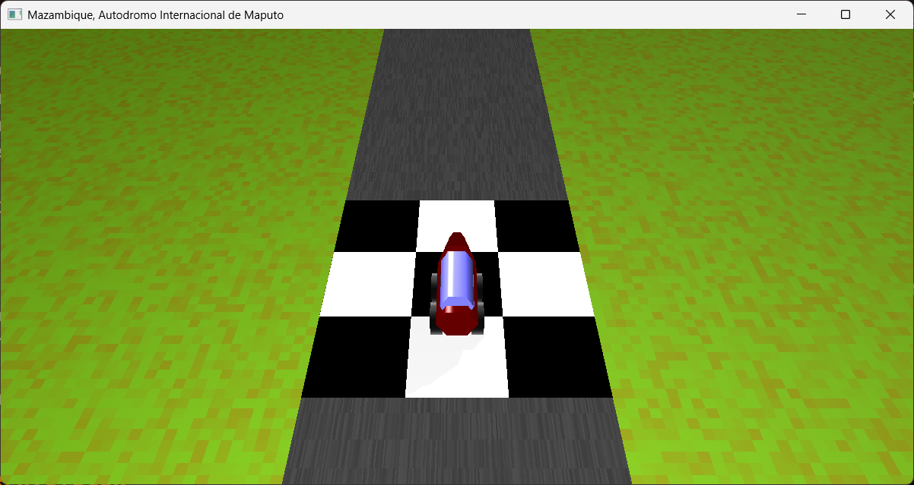
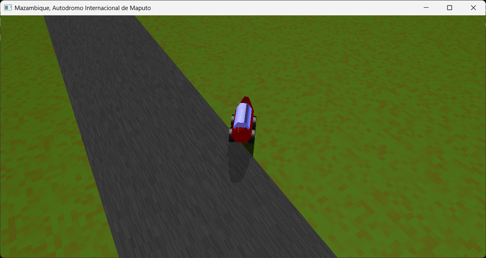
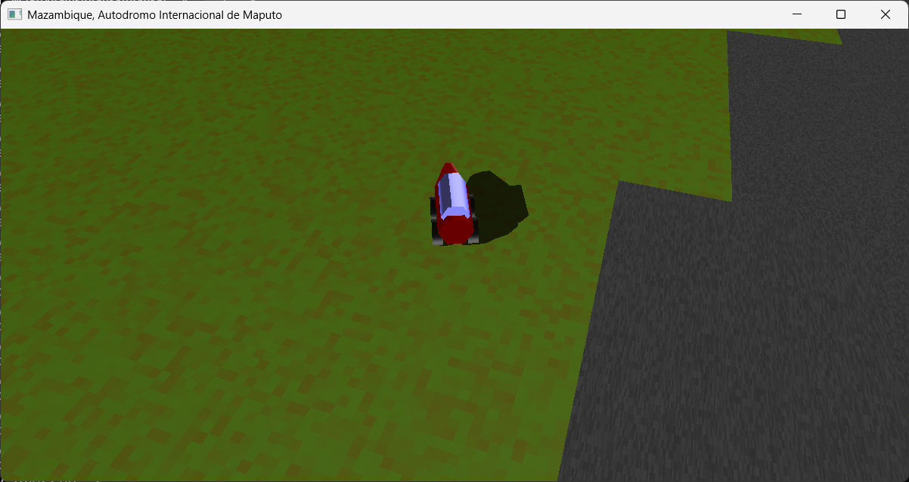

# Grafika nagy házifeladat
A tárgyból ekészített nagy házifeladatom, ami egyegyserű autóversenyzős játék, a *mozamiki Autodromo Internacional de Maputo* versenypályán.

## Leírás
A feladatban az ötödik laborból indultam ki, hasonlóan inkrementális képszínezéssel történik az objektumok kirajzolása, a GPU segítségével. Érdemes a Windows-on beül beállítani, hogy az alkalmazást a rendes GPU-val futtassa, ne a processzorba építettel.

*(gépház / kijelző / grafika / asztali alkalmazás hozzáadása / .exe kiválasztása, majd átállítás az erősebb GPU-ra)* de [itt egy kis segítség](https://www.itechtics.com/use-specific-gpu/)

Az autó több objektumból áll össze, hengerből, vágott hengerből (frustum), és kúpból, ezek mozognak együtt az egér irányítására. A pálya több négyzetből áll, ezek aszfalttal vannak textúrázva, illetve a pálya mellett fűtextúrázott óriásnégyzet is látható (ha laggol a játék, akkor ezt ki lehet szedni, mert sokat dob a gépigényen.)

Irányítás:
- W/S - lassítás, gyorsítás
- T/G - kamera fel, le
- egér mozgatása - autó irányítása (az autó az egér irányába fog menni mindig)
- P - pause, alapból meg van állítva a biztonság kedvéért, így ezzel kell kezdeni
- R - reset, az autó visszaáll az induló pozícióba, 0 sebességgel.

Ha az autó lehajt a pályáról, akkor megakad a fűben, de nem rögtön, hanem van egy kis kifutása, hiszen van lendülete is.

## Képernyőfotók

### Indításkor

### Kifutás a szélére

### Kifutás nagyobb sebességgel

