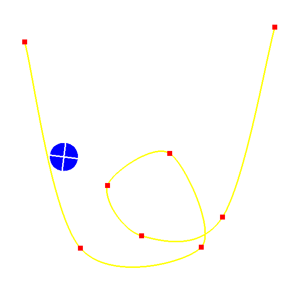

# Hullámvasút
2D hullamvasút szimuláció

## Leírás
Ebben a feladatban egy 2D hullámvasút szimulációt kell megvalósítani. A hullámvasút pályája Catmull-Rom spline, amelyet a kontrollpontjai definiálják. A spline uniform paraméterezésű, azaz a csomóértékek különbsége minden két egymás utáni kontrollpontra ugyanaz. A legelső és legutolsó kontrollpontban az Hermite interpolációhoz használt sebességvektor (azaz a spline paraméter szerinti deriváltja) zérus.

## JPorta által elfogatott kép

